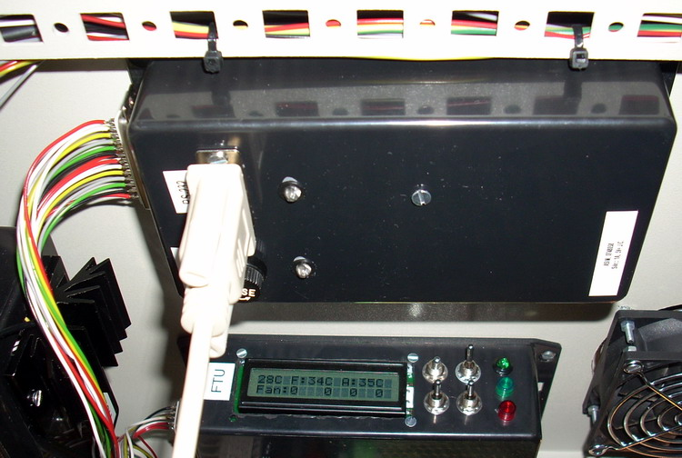

## Source code for project: [Advanced serial interface module](https://link.stdout.no/h)

ASIM provides 6 analog and 2 digital inputs, and 9 digital outputs for the computer serial port. Uses an AVR ATmega8 microcontroller.

Written in basic, using [Bascom-AVR](http://www.mcselec.com/).

### Author
[Thomas Jensen](https://thomas.stdout.no)
